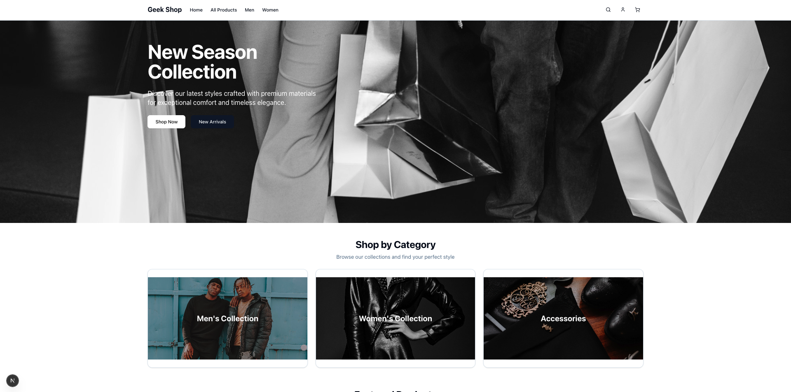
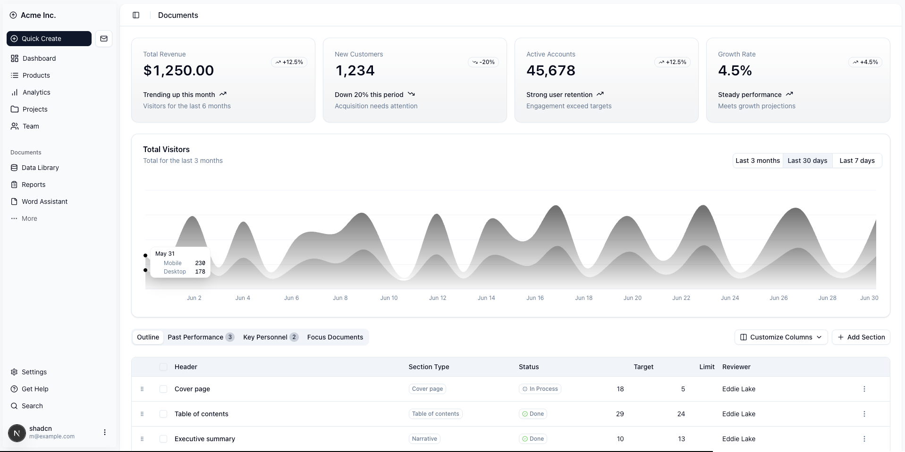

# Geek Shop Project

A Next.js application designed for Shopify integrations with various functionalities utilizing modern web libraries and tools.

## Project Information

- **Name:** Shopify
- **Version:** 0.1.0

## Table of Contents

- [Getting Started](#getting-started)
- [Scripts](#scripts)
- [Dependencies](#dependencies)
- [Development](#development)
- [Contributing](#contributing)

## Getting Started

To get started with this project, ensure you have [Node.js](https://nodejs.org/) (version 14 or higher) and [Docker](https://www.docker.com/) installed on your machine.

### Installation

.Install dependencies:
	 ```bash
	 bun install
	 ```

### Environment Variables

Before running the application, ensure your `.env` file is set up correctly. Refer to `.env.example` for the required environment variables.

## Scripts

### Available Scripts

| Script      | Description                                      |
|-------------|--------------------------------------------------|
| `dev`       | Start the development server with Turbopack      |
| `db:run`    | Run the database with Docker Compose             |
| `build`     | Build the application for production             |
| `start`     | Start the production server                      |
| `lint`      | Run ESLint to check for code quality             |
| `format`    | Format code using Prettier                       |
| `migrate`   | Run database migrations with Prisma              |
| `generate`  | Generate the Prisma Client                       |
| `seed`      | Execute the seed script to populate the database |
| `db:studio` | Open Prisma Studio                               |

## Dependencies

This project is built on various libraries and tools that enhance its functionality. Here are some notable dependencies:

- **@auth/core**: Authentication library
- **@prisma/client**: Database ORM
- **next**: React Framework for server-rendered applications
- **react**: JavaScript library for building user interfaces
- **tailwindcss**: Utility-first CSS framework
- **zod**: Type validation library

Refer to `package.json` for a complete list of dependencies.

## Development

When developing, you can use the following tools in conjunction with the provided scripts:

- **Linting and Formatting**: Maintain code quality with ESLint and Prettier
- **Type Checking**: Use TypeScript to ensure type safety
- **Debugging**: Utilize tools in your IDE for effective debugging

## Contributing

Contributions are welcome! Please follow these steps to contribute:

1. Fork the repository.
2. Create your feature branch (`git checkout -b feature/YourFeature`).
3. Commit your changes (`git commit -m 'Add new feature'`).
4. Push your branch (`git push origin feature/YourFeature`).
5. Open a pull request.

---


